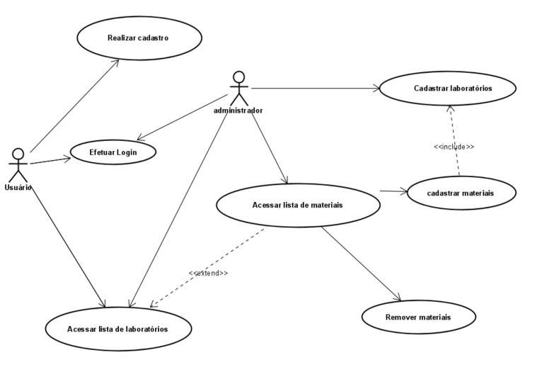

## Especificação do Projeto

A definição exata do problema e os pontos mais relevantes a serem tratados neste projeto foi consolidada com a participação dos usuários em um trabalho de imersão feita pelos membros da equipe a partir da observação dos usuários em seu local natural e por meio de entrevistas. Os detalhes levantados nesse processo foram consolidados na forma de personas e histórias de usuários.

## Personas

As personas levantadas durante o processo de entendimento do problema são apresentadas nas Figuras que se seguem.

## Histórias de Usuários

A partir da compreensão do dia a dia das personas identificadas para o projeto, foram registradas as seguintes histórias de usuários.

## Requisitos do Projeto

Após identificar todas as necessidades e demandas propostas pelas personas do projeto foi possível determinar as funcionalidades que o sistema deve apresentar para atender tais solicitações.

### Requisitos Funcionais

A tabela a seguir apresenta os requisitos do projeto, identificando a prioridade em que os mesmos devem ser entregues.

| **ID** | **Descrição** | **Prioridade** |
| --- | --- | --- |
| RF-01 | O sistema deve permite encontrar entidades certificadoras para determinado material | Alta |
| RF-02 | O sistema deve fornecer informações referente as normas e certificações que devem ser cumpridas pelas construtoras.  | Baixa |
| RF-03 | O sistema deve permitir o cadastro do perfil laboratórios (fornecedor) de ensaios com as informações: nome da empresa, contato, localização.  | Alta |
| RF-04 | O sistema deve disponibilizar notícias sobre eventos, treinamentos e informações relevantes para o setor.  | Baixa |
| RF-05 | O sistema deve conter local com arquivos PDF, incluindo orientações para o checklist na obtenção da certificação de materiais.| Baixa |
| RF-06 | O sistema deve permitir update para alteração/inativação das empresas já cadastradas.| Alta |

### Requisitos Não Funcionais

A tabela a seguir apresenta os requisitos não funcionais que o projeto deverá atender.

| **ID** | **Descrição** | **Prioridade** |
| --- | --- | --- |
| RNF-01 | Deverá ser providenciado o ambiente de hospedagem do site, no qual permitirá sua publicação na internet e a manutenção do mesmo durante seu ciclo de vida. (Provedor de nuvem, Github Pages, etc.) | Alta |
| RNF-02 | A interface deverá utilizar linguagens front-end padrões (HMTM, CSS, JavaScript). | Baixa |
| RNF-03 | O sistema deverá ser integrado aos mecanismos de pesquisa na internet (Google, Bing, Yahoo Search). | Média |
| RNF-04 | O sistema deve ser compatível com os principais navegadores do mercado (Google Chrome, Firefox, Microsoft Edge). | Alta |
| RNF-05 | O funcionamento interno do site deverá ser desenvolvido utilizando algoritmos otimizados para a filtragem das opções solicitadas. | Baixa |
| RNF-06 | O sistema deve comportar alternativas de acesso às suas funcionalidades de forma permitir delas a usuários com diferentes dificuldades | Alta |

### Restrições

As questões que limitam a execução desse projeto e que se configuram como obrigações claras para o desenvolvimento do projeto em questão são apresentadas na tabela a seguir.

| **ID** | **Descrição** |
| --- | --- |
| RE-01 | O projeto deverá ser entregue no final do semestre letivo, não podendo extrapolar a data de 07/11/2021. |
| RE-02 | Fica condicionado ao perfil administrador  a inclusão/exclusão dos laboratórios e materiais cadastrados..  |
| RE-03 | A equipe não pode subcontratar o desenvolvimento do trabalho. |

### Diagrama de casos de uso

Este diagrama busca apresentar o sistema na perspectiva do usuário, demonstrando as funcionalidades e os serviços oferecidos e quais usuários poderão utilizar cada funcionalidade.
Esse diagrama tem por objetivo orientar,prioritariamente, a modelagem do sistema durante o levantamento e a análise de requisitos.
O documento sendo consultado durante o processo de engenharia, poderá ser modificado e ser modelo-base para a modelagem de outros diagramas.

Figura 1 - Use Case

