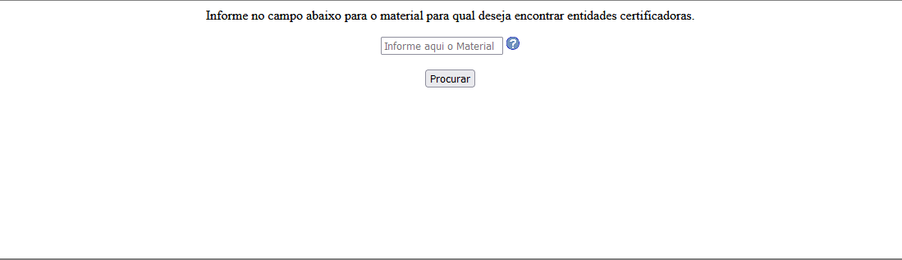

# 7. Funcionalidades do Sistema (Telas)

Nesta seção são apresentadas as telas desenvolvidas para cada uma das funcionalidades do sistema. O respectivo endereço (URL) e outras orientações de acesso são apresentadas na sequência.

## Tela de Consulta

Página que permite buscar por entidades certificadoras de material.



Disponível em:
[https://github.com/ICEI-PUC-Minas-PMV-ADS/pmv-ads-2021-2-e2-proj-int-t5-certificacao-de-materiais/blob/main/src/consulta.html](https://github.com/ICEI-PUC-Minas-P>

### **Requisitos atendidos**

* RF-01

### **Artefatos da funcionalidade**

* consulta.html
* consulta.php
* subpages.css
* help.png
* cria.sql
* popula.sql

### **Estrutura de Dados**

Abaixo, estrutura do banco utilizado por esta funcionalidade.

```sql
CREATE DATABASE CertMat;
USE CertMat;

CREATE TABLE Laboratorio (
    Nome varchar(255) NOT NULL, 
    Usuario varchar(30), 
    Senha varchar(30),
    Contato varchar(255),

    PRIMARY KEY (Nome)
);

CREATE TABLE Material (
    Nome varchar(255) NOT NULL, 
    
    PRIMARY KEY(Nome)
);

-- Junction Laboratorio/Material

CREATE TABLE Certificacao (
    Laboratorio_Nome varchar(255),
    Material_Nome varchar(255),

    CONSTRAINT FK_Laboratorio FOREIGN KEY (Laboratorio_Nome) REFERENCES Laboratorio (Nome),
    CONSTRAINT FK_Material FOREIGN KEY (Material_Nome) REFERENCES Material (Nome),

    CONSTRAINT PK_Certificacao PRIMARY KEY (Laboratorio_Nome, Material_Nome)
);

```


### **Instruções de acesso**

1. Abra um navegador de Internet e informe a URL do projeto (ainda não publicado).
2. A tela de Consulta é a página padrão exibida pelo site.
