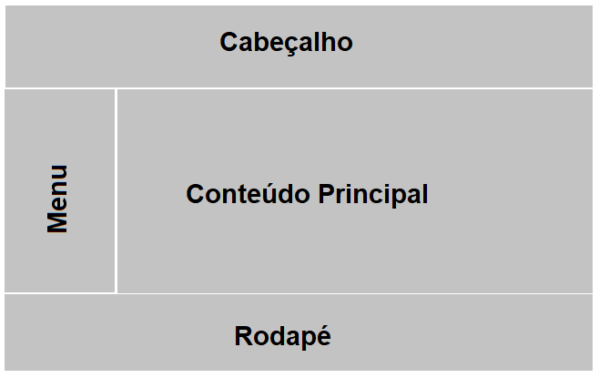

# Template Padrão da Aplicação

O layout da aplicação é documentado na figura abaixo, seguido da descrição de cada um de seus elementos.

Componentes:
* **Cabeçalho:** comporta o logo da aplicação e informações de login.
* **Menu:** concede acesso às outras páginas do site.
* **Conteúdo Principal:** exibe o conteúdo em evidência.
* **Rodapé:** exibe informações de contato e documentais.

